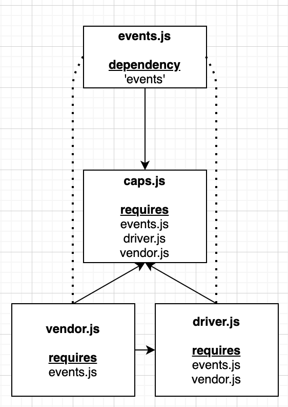
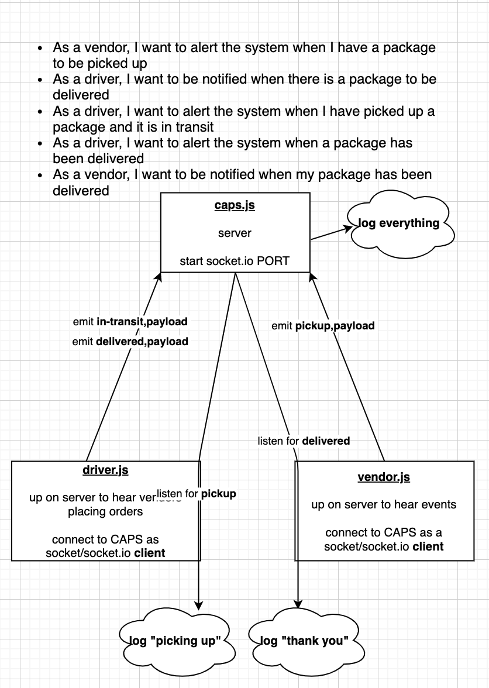
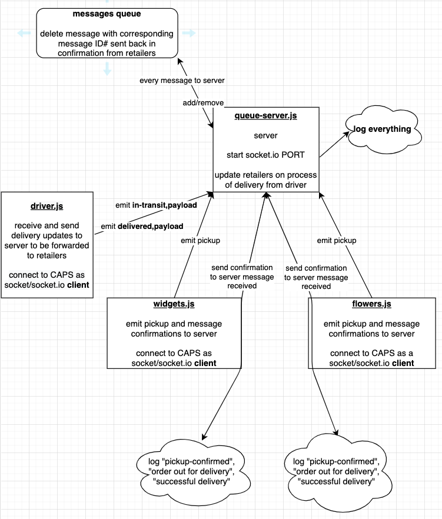

# LAB - CLASS 11 + 12

## Project: Event Driven Application & Socket.io

### Author: Mariko Alvarado

### Links and Resources
-  Simon, Ricardo, Nathan,Dina

- [GHActions](https://github.com/Mariko-401-AdvancedJs/CAPS/actions)
- [PR](https://github.com/Mariko-401-AdvancedJs/CAPS/pulls?q=is%3Apr+is%3Aclosed)

### Setup

#### How to initialize/run your application (where applicable)

run `node caps.js` in command line
run `node vendor.js` in command line
run `node driver.js` in command line

#### Tests

1. install `jest`
2. run `npm test` 

#### UML

# LAB - CLASS 13

## Project: Message Queues

### Author: Mariko Alvarado

### Links and Resources

- [GHActions](https://github.com/Mariko-401-AdvancedJs/CAPS/actions)
- [PR](https://github.com/Mariko-401-AdvancedJs/CAPS/pull/4)

### Setup

#### How to initialize/run your application (where applicable)

run `node queue-server.js` in command line
run `node flowers.js` in command line
run `node widgets.js` in command line
run `node driver.js` in command line

#### Tests

1. install `jest`
2. run `npm test` 

#### UML

